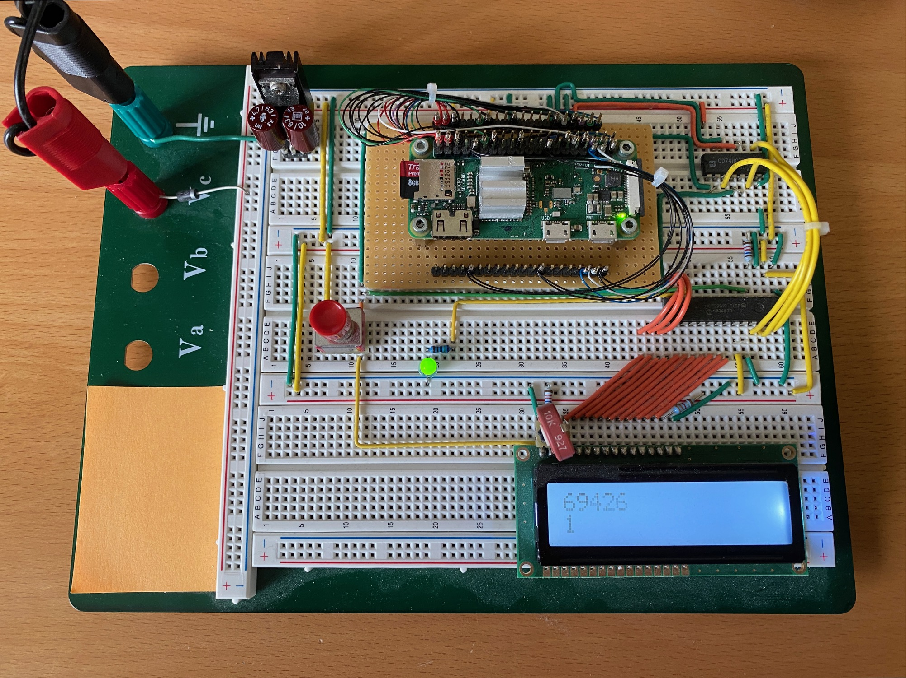

Osek_pi_spigot_metal
==================

    
    
    
    

Osek_pi_spigot_metal computes $100,001$ decimal digits
of the mathematical constant $\pi$ on a bare-metal RaspberryPi(R)-Zero system.

The backbone real-time operating system is taken directly
from the OSEK-like OS implemented in
[Chalandi/OSEK_Raspberry_Pi_Zero](https://github.com/Chalandi/OSEK_Raspberry_Pi_Zero)

This fascinating, educational and fun project combines the domain
of high-performance numerical computing with the raw simplicity of
bare-metal embedded microcontroller systems.

# Software Details

In this project, $100,001$ decmal digits of $\pi$ (i.e., one-hundred-thousand-and-1)
are computed with a spigot algorithm.

The spigot calculation has quadratic numerical complexity of order $N^2$
and is, for high digit counts, generally considered slower
than some other popular calculation methods such as AGM.
The one-hundred-thousand-and-1 decimal digit $\pi$ calculation
requires slightly more than 20 minutes on this target system.

The microcontroller boots and performs static initialization via self-written
startup code. Hardware setup including stack initialization,
FPU/MMU/LMU-enable, data and instruction caching, etc. is carried out
with self-written hybrid assembly/C/C++ code in the subroutine `mcal_init()`
shortly after reaching `main()`. Immediately following this,
we start the OS via call to `OS_StartOS(...)`. These sequences
can be found in [main.c](./Appli/main.c).

The pi-spigot calculation runs continuously and successively in the
application's idle-task. LED-blinky and calculation progress
presented on an LCD display are controlled within a higher-priority
extended task named `T1`. Calculation correctness is verified with
a hash sum of the character representation of the digits computed.

Compact code size is in focus and the entire project compiles to about 16k
of program code, with slight variations depending optimization options.
The calculation does, however, require ample RAM of about 1.5 Mbyte.

# Prototype Project

The target hardware on a breadboard is taken directly
from the similar project
[ckormanyos/pi_crunch_metal](https://github.com/ckormanyos/pi-crunch-metal).
It runs on a
[RaspberryPi(R)-Zero](https://www.raspberrypi.org/products/raspberry-pi-zero).

The build system is set up to use GCC, making use of the `arm-none-eabi`
compiler. The default optimization setting is `-O2`.

The hardware setup is pictured in the image below.
In this image, the target system has already completed
one $\pi$ calculation and is well underway on its
second one back-to-back.

